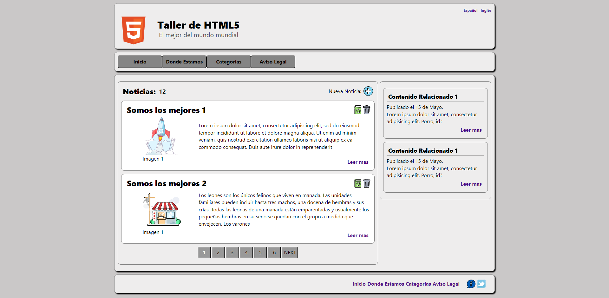
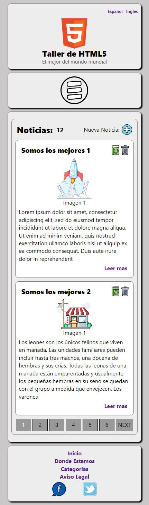

# Taller de HTML 5
---

## CRUD - V1 (Responsive)

WEB 💻 - [Taller HTML 5](https://entrega1-ivan-pizarroso.netlify.app/)
GitHub 😺 - [Repositorio](https://entrega1-ivan-pizarroso.netlify.app/)

### Indicaciones Generales
- Se realiza el guardado de los datos en el localStorage con la key "dates".
- Se cargan por defecto 3 noticias de prueba al iniciar la aplicación.
- Al crear una nueva noticia (botón azul) se le agregan las validaciones propias de HTML en el formulario.
- En el momento de eliminar una noticia existente (botón cubo de basura) se interrumpe el proceso para preguntar si realmente quieres eliminarla,   como medida de seguridad.
- Para la modificación de una noticia ya existente, presiona el botón verde junto al cubo de basura, apareciendo un formulario auxiliar.
- Se realiza la paginación de las noticias mostrándolas de dos en dos y se utiliza JS sin cambiar la URL como se indica en los requerimientos. 